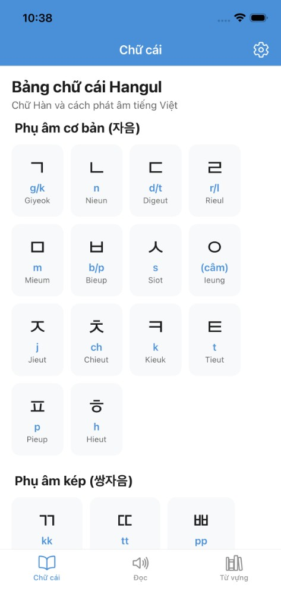
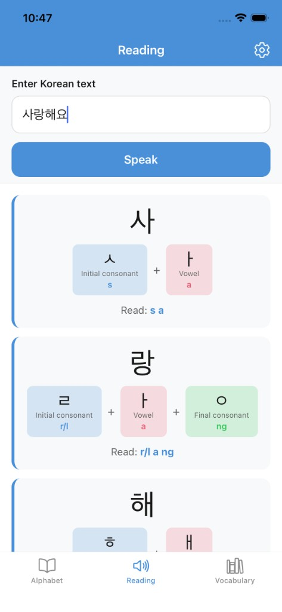
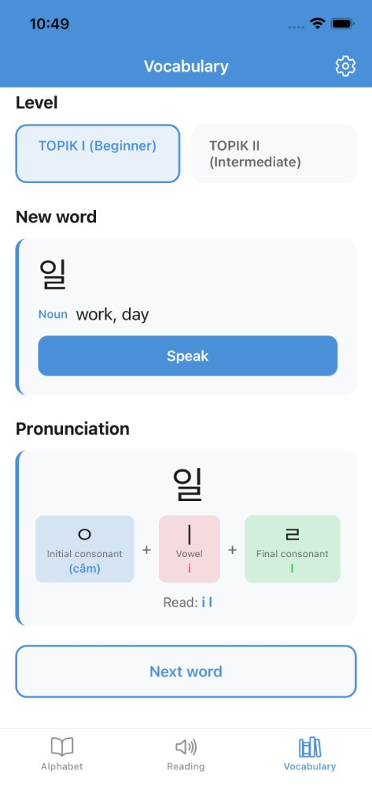
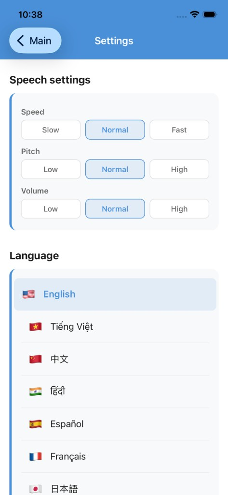

# KKorea Hangul

A Korean (Hangul) learning app for Vietnamese speakers, built with **React Native** and **Expo**. The app UI is available in 7 languages.

## Screenshots

**Alphabet** — Hangul letters with romanization and “group by sound” for batchim.



**Reading** — Enter Korean text, see syllable breakdown and use Speak (TTS).



**Vocabulary** — TOPIK I/II levels, new word, pronunciation breakdown, next word.



**Settings** — Speech (speed, pitch, volume, voice), language (7 locales with flags), About.



## Features

- **Alphabet** — Browse the full Hangul alphabet by group: basic consonants, double consonants, basic vowels, compound vowels, and batchim (final consonants). Each character shows romanization. Optional “group by sound” view for batchim.
- **Reading** — Type Korean text and see each syllable decomposed into initial consonant, vowel, and final consonant with pronunciation. **Speak** button for text-to-speech (TTS).
- **Vocabulary** — Study TOPIK I and II vocabulary with random word display, TTS, and syllable breakdown. Level and all labels follow app language.
- **Settings** (gear icon in header) — Single screen with:
  - **Speech settings** — Speed, pitch, volume, and Korean voice selection. Applies to both Reading and Vocabulary.
  - **Language** — App UI in 7 languages (native names + flags): English, Tiếng Việt, 中文, हिंदी, Español, Français, 日本語.
  - **About** — App description and author (Phạm Huy Đức). Back button label is localized (e.g. “Màn hình chính” / “Main”).

All on-screen labels (tabs, buttons, hints, level names, part-of-speech, decomposition labels) are localized.

## Prerequisites

- [Node.js](https://nodejs.org/) (LTS recommended)
- [Expo Go](https://expo.dev/go) on your device, or iOS Simulator / Android Emulator

## Installation

```bash
git clone https://github.com/kataro92/KKoreaHangul.git
cd KKoreaHangul
npm install
```

## Usage

Start the development server:

```bash
npm start
```

Then:

- Scan the QR code with **Expo Go** (Android/iOS), or
- Press **i** for iOS Simulator, **a** for Android emulator, or **w** for web.

### Scripts

| Command           | Description           |
|-------------------|-----------------------|
| `npm start`       | Start Expo dev server |
| `npm run ios`     | Run on iOS            |
| `npm run android` | Run on Android        |
| `npm run web`     | Run in the browser    |

## Project structure

```
├── app/
│   ├── _layout.tsx          # Root layout, LanguageProvider, SpeechConfigProvider
│   ├── settings.tsx         # Settings (speech, language, about)
│   └── (tabs)/
│       ├── _layout.tsx      # Tab navigator + gear icon → Settings
│       ├── index.tsx        # Alphabet screen
│       ├── reading.tsx      # Reading screen (input + TTS)
│       └── vocabulary.tsx   # Vocabulary screen
├── src/
│   ├── components/         # CharacterCard, CategorySection, DecomposedResult
│   ├── constants/          # colors
│   ├── contexts/           # LanguageContext (i18n), SpeechConfigContext (TTS)
│   ├── data/               # hangul.ts, vocabulary.json
│   └── utils/              # decompose.ts (Hangul syllable decomposition)
├── screenshots/             # App screenshots for README
└── scripts/                 # parse-topik-vocab.js (vocabulary from PDF)
```

## Author

**Phạm Huy Đức**

## License

[MIT](LICENSE) — see [LICENSE](LICENSE) for details.
